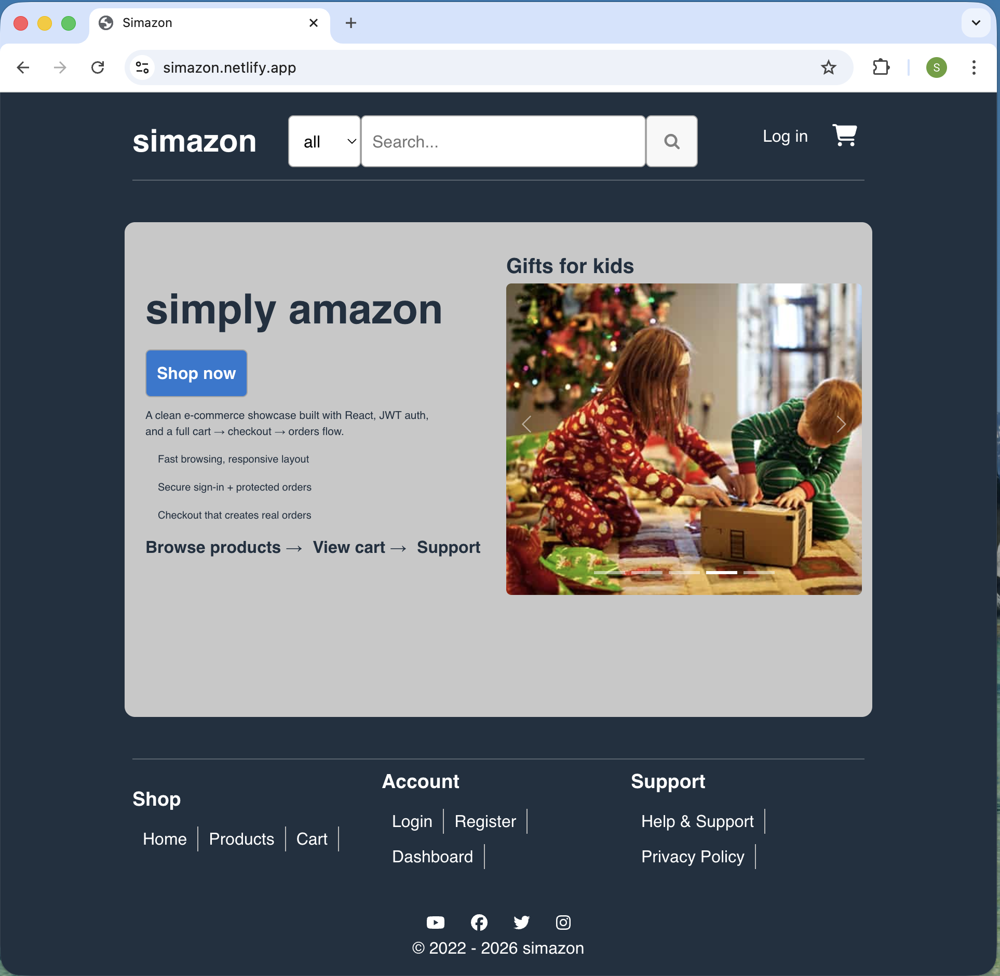

## Simazon 🛒

**Simazon** is a full-stack e-commerce demo implementing authenticated user flows, persistent cart state, and order creation.  
It showcases end-to-end ownership of a transactional system spanning UI, API, and persistence, with emphasis on correctness, state consistency, and extensibility.

### Tech stack
- **Frontend:** React
- **Backend:** REST API (Node.js / Express)
- **Auth:** JWT-based stateless authentication
- **Persistence:** Database-backed carts and orders

### Features
- Product browsing with search and category filtering
- User authentication with protected routes
- Persistent cart (add, remove, update quantities)
- Checkout flow that creates and stores orders
- User dashboard with profile and order history
- Role-aware patterns supporting future admin workflows

🔗 **Live demo:** [simazon](https://simazon.netlify.app/)
